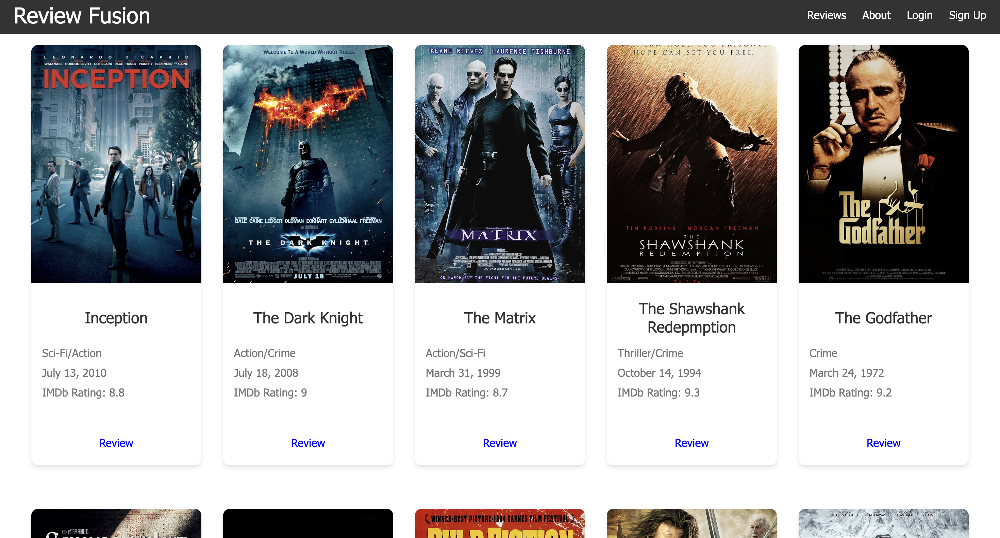
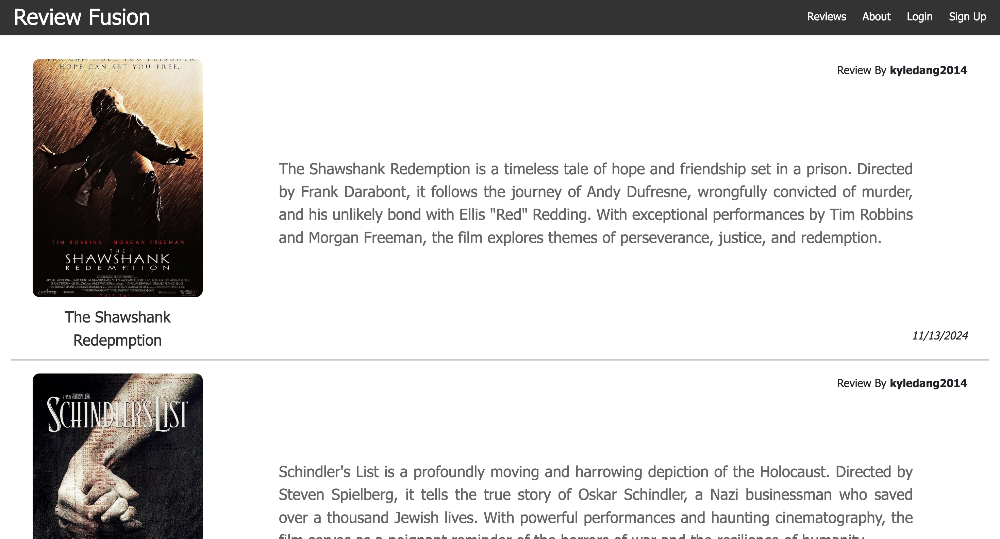

# Review Fusion

## Overview

Review Fusion is a movie review website. The platform provides users with a seamless experience for discovering and managing movie reviews.

## Features

- Explore a wide range of movies
- Write and submit movie reviews
- Read and engage with other users' reviews





## Prerequisites

Before running Review Fusion locally, ensure you have the following installed:

- [Node.js](https://nodejs.org/) (latest LTS version recommended)
- [npm](https://www.npmjs.com/) (comes with Node.js)

## Installation

1. Navigate to the project directory:
   ```sh
   cd review-fusion
   ```
2. Install dependencies:
   ```sh
   npm install
   ```

## Running the Application

To start the development server, execute:

```sh
npm start
```

This will start the application and it will be accessible at `http://localhost:3000/` (or the specified port in your configuration).